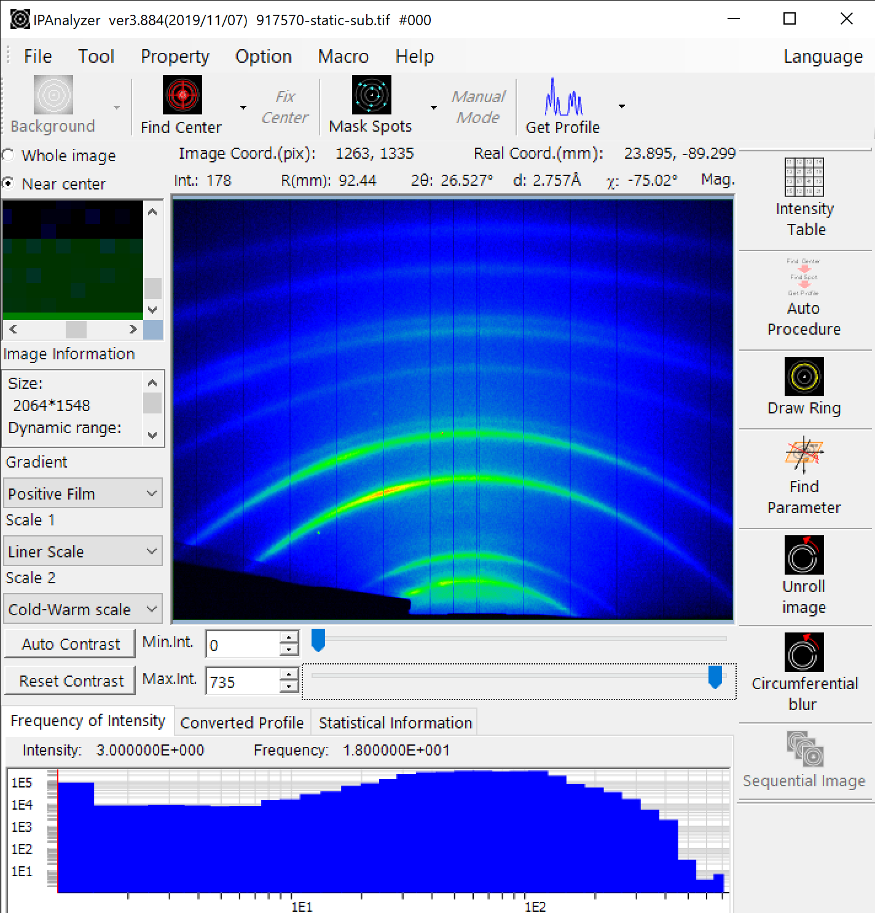
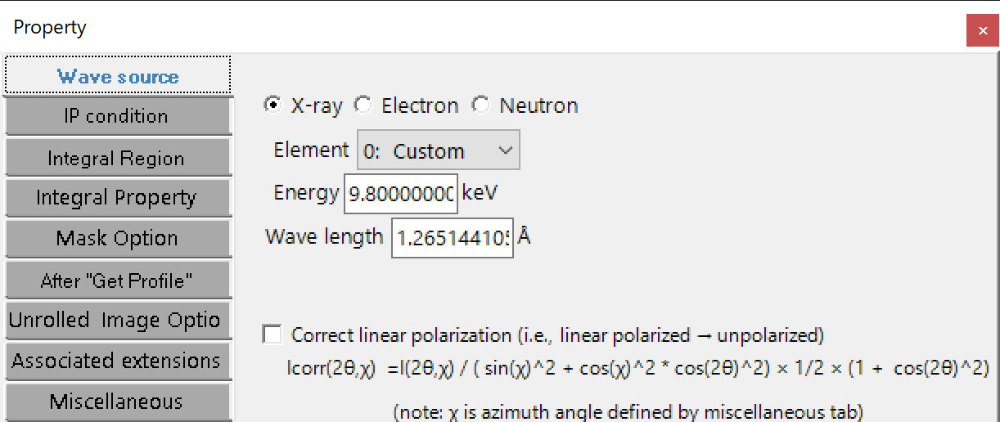
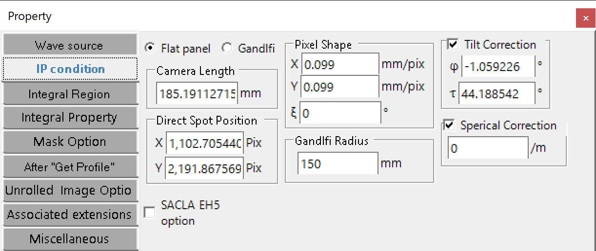
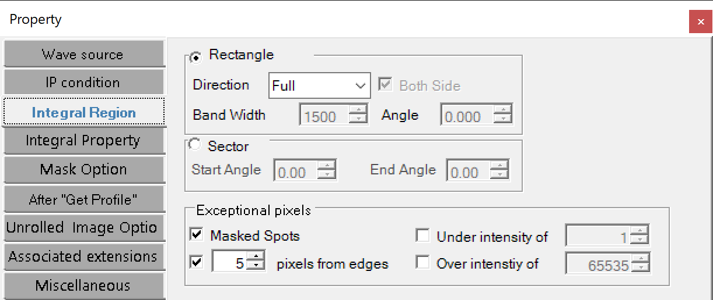
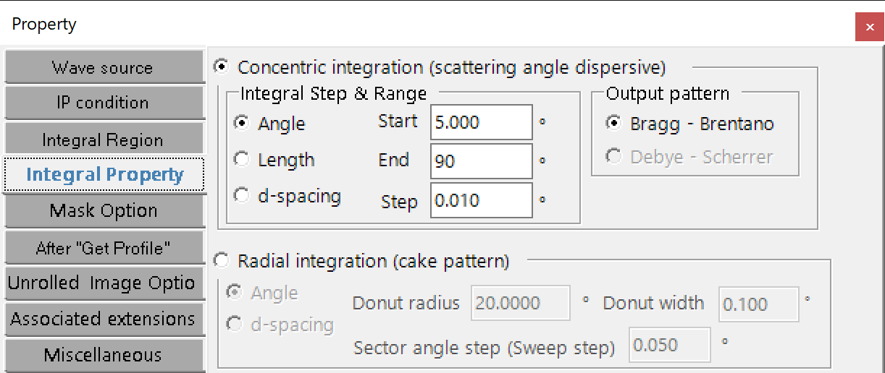
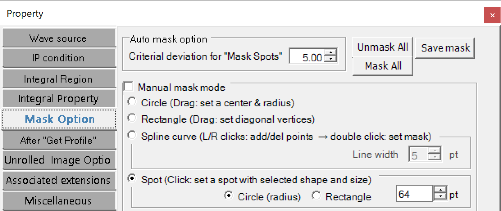
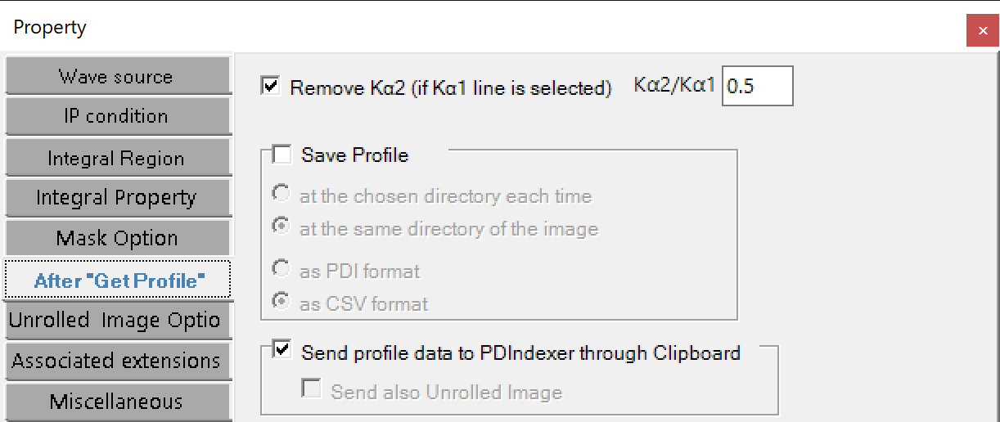
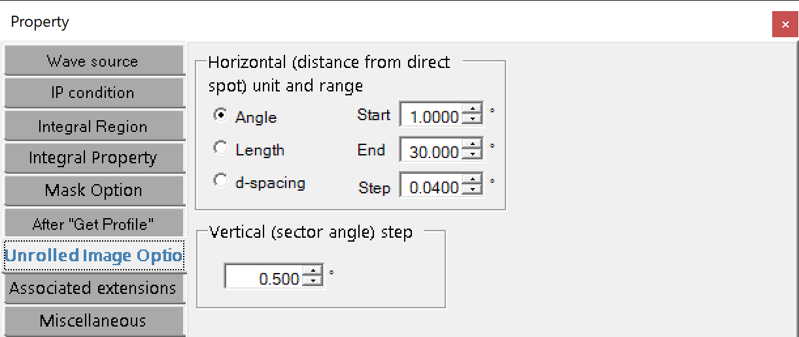
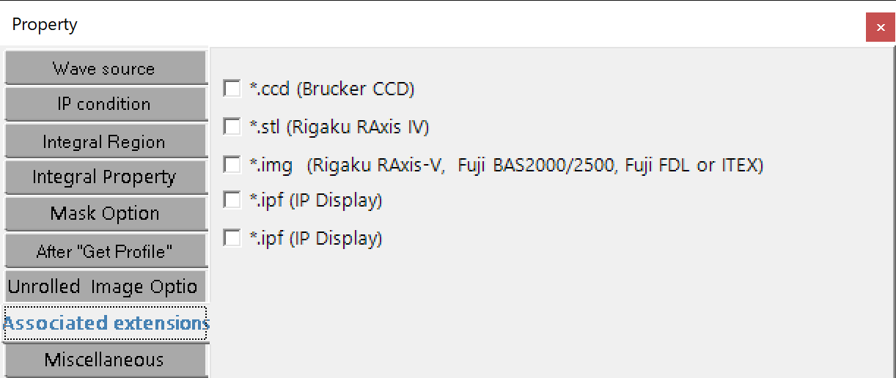
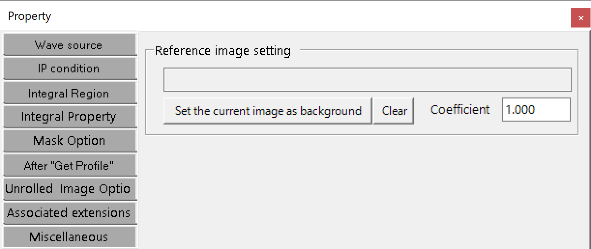

# IPAnalyzer
The software *IPAnalyzer* is a Windows application (.Net Framework 4.8) which processes Debye-ring patterns  collected by flat panel detectors.

## Install
Access https://github.com/seto77/IPAnalyzer/releases/latest, download *IPAnalyzerSetup.msi*, and execute it.

## Main features
* something
  
## Screenshots
    
  
  
  
  
