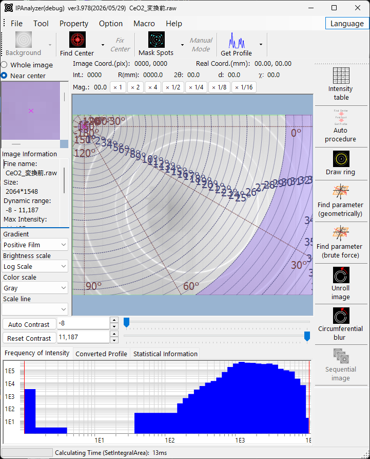

<!-- 260601Cl: Reflected from ja/1-main-window.md (lead language: Japanese). -->

# Finestra principale

La finestra principale è la prima schermata mostrata all'avvio di IPAnalyzer. Riunisce la visualizzazione dell'immagine di diffrazione caricata, le operazioni principali (ricerca del centro, mascheratura degli spot, monodimensionalizzazione) e i punti di accesso alle impostazioni dei parametri del rivelatore.

La finestra è costituita, a grandi linee, dai menu e dalla barra degli strumenti in alto, dall'area di visualizzazione dell'immagine al centro, dalla barra degli strumenti verticale a destra e dall'area del grafico in basso.

## Vista centrale

### Visualizzazione dell'immagine

L'immagine caricata viene visualizzata qui. A seconda della posizione del puntatore del mouse, l'area sopra l'immagine mostra le coordinate reali (mm), le coordinate dell'immagine (pix), la distanza dal centro R (mm), l'angolo di diffusione 2θ, il valore d, l'azimut χ e l'intensità. Il segno × magenta indica la posizione dello spot diretto (centro).

Gli stati dei pixel sono mostrati con colori distinti.

| Colore | Significato |
| --- | --- |
| Ciano | Spot mascherato |
| Verde | Regione esclusa dall'integrazione (impostata in Integral Region) |
| Magenta | Regione angolare esclusa dall'integrazione (impostata in Integral Property) |
| Blu | Pixel sotto la soglia di intensità (impostata in Integral Region) |
| Rosso | Pixel sopra la soglia di intensità |

### Operazioni con il mouse

In modalità normale:

- Premere e tenere premuto il pulsante sinistro: cerca il centro dello spot nelle vicinanze.
- Doppio clic sinistro: aggiorna la posizione del centro al punto cliccato.
- Trascinamento con il destro: ingrandisce la regione trascinata.
- Clic destro: riduce lo zoom.

In **Manual spot mode**, il clic sinistro maschera e il clic destro rimuove la maschera. La forma e la dimensione della maschera si impostano nella barra degli strumenti e nelle proprietà.

### Viste ausiliarie e informazioni sull'immagine

Accanto alla vista centrale ci sono visualizzazioni ausiliarie. È possibile passare tra **Whole image** e **Near center**: la vista dell'immagine intera evidenzia l'intervallo di visualizzazione corrente con un riquadro giallo, mentre la vista vicino al centro mostra un'immagine ingrandita.

**Image Information** mostra la risoluzione dell'immagine, l'intensità massima, l'intensità totale, i dati dell'header e così via.

### Controlli di regolazione della visualizzazione

Controlli che regolano l'aspetto dell'immagine:

- **Gradient**: inverte il tono.
- **Brightness scale**: logaritmica / lineare.
- **Color scale**: scala di grigi / colore.
- **Scale line**: visualizzazione delle linee di scala (nessuna / grossolana / media / fine).
- **Auto Contrast** / **Reset Contrast**, e intensità minima/massima esplicite.
- Pulsanti di ingrandimento (×1, ×2, ×4, ×1/2, ×1/4, ×1/8, ×1/16).

## Vista inferiore

L'area inferiore presenta tre grafici/viste a schede.

- **Frequency of Intensity**: la distribuzione di intensità di tutti i pixel, su assi log–log. Ingrandibile con il mouse.
- **Converted Profile**: il profilo di diffrazione dopo la monodimensionalizzazione (Get Profile). Ingrandibile con il mouse.
- **Statistical Information**: statistiche per una regione rettangolare selezionata (X1,Y1)–(X2,Y2). Quando è caricata un'immagine sequenziale, è possibile confrontare anche le statistiche della stessa regione in altri frame.

## Menu

La barra dei menu è costituita da **File / Tool / Property / Option / Language / Macro / Help**.

### File

- **Read image**: apre un'immagine di diffrazione. Vedere [Panoramica](0-overview.md) per i formati supportati.
- **Save image**: salva in formato TIFF, PNG, CSV o IPA. TIFF conserva le intensità dei pixel originali, PNG conserva la visualizzazione (luminosità, contrasto, maschera) e IPA è un formato proprietario con correzione della distorsione (con metadati).
- **Read / Save parameter**: importa/esporta la lunghezza d'onda, la lunghezza di camera, la dimensione del pixel, la correzione dell'inclinazione, la posizione del centro, ecc. come file `.prm`.
- **Read / Save / Clear mask**: importa/esporta una maschera come file `.mas`, oppure la cancella (la maschera deve corrispondere alla risoluzione dell'immagine corrente).
- **Close**.

I file di immagine, parametro e maschera possono essere caricati anche trascinandoli e rilasciandoli sulla finestra.

### Tool

- **Reset Frequency Profile**: cancella il grafico della frequenza di intensità (l'immagine viene mantenuta).
- **Calibrate Raxis Image**.

### Property

Wave Source / Imaging Plate Condition / Integral Region / Integral Property / Manual Mask Mode / After "Get Profile" / Unrolled Image Option / Miscellaneous. Questi aprono direttamente le schede corrispondenti della [finestra delle proprietà](2-property-windows.md).

### Option

- **ToolTip**: attiva/disattiva i tooltip su pulsanti e menu.
- **Flip**: orizzontale / verticale. **Rotate**: scegli un angolo di rotazione. Entrambi influiscono solo sulla visualizzazione; i dati dell'immagine caricata non vengono modificati.
- **Ngen Compile** e **Clear registry** sono per lo sviluppo e la risoluzione dei problemi.

### Language

- Passa tra **English** e **Japanese** (l'impostazione è salvata nel registro).

### Macro

- **Editor**: apre l'editor di macro (vedere [Strumenti](3-tools.md) / [Macro](5-macro/index.md)).

### Help

- **Program Updates**, **Hint**, **License**, **Version History**, **Web Page**.

## Barra degli strumenti delle operazioni

Le principali operazioni di elaborazione dell'immagine (con opzioni dettagliate nei menu a discesa):

- **Background**: sottrazione di un'immagine di fondo (configurata in Background Option).
- **Find Center**: rileva il centro del fascio mediante fitting Pseudo-Voigt 2D (intervallo di ricerca 8 px per impostazione predefinita, impostato in Miscellaneous). Il menu a discesa offre anche il rilevamento del centro basato sugli anelli.
- **Fix center**: fissa la posizione del centro.
- **Mask Spots**: rileva e maschera gli spot usando il criterio media ± deviazione standard × Deviation. Il menu a discesa include mask-all, inverse-mask, manual e così via.
- **Manual**: la modalità di mascheratura manuale. È possibile scegliere la forma (cerchio / rettangolo) e la dimensione (8–256 px).
- **Get Profile**: integra l'immagine in un profilo unidimensionale. Supporta Concentric (basata su 2θ) e Radial (basata sull'azimut). Il menu a discesa configura la selezione di Integral Property/Region, se eseguire la ricerca del centro e la mascheratura degli spot prima dell'integrazione, l'invio a PDIndexer, l'analisi per divisione azimutale, l'elaborazione di immagini sequenziali e così via.

## Barra degli strumenti (altri strumenti)

La barra degli strumenti verticale a destra avvia i vari strumenti. Vedere [Strumenti](3-tools.md) per i dettagli.

- **Intensity Table**
- **Auto Procedure**
- **Draw ring**
- **Find parameter** / **Find parameter (brute force)**
- **Unroll**
- **Circumferential Blur**
- **Sequential**
