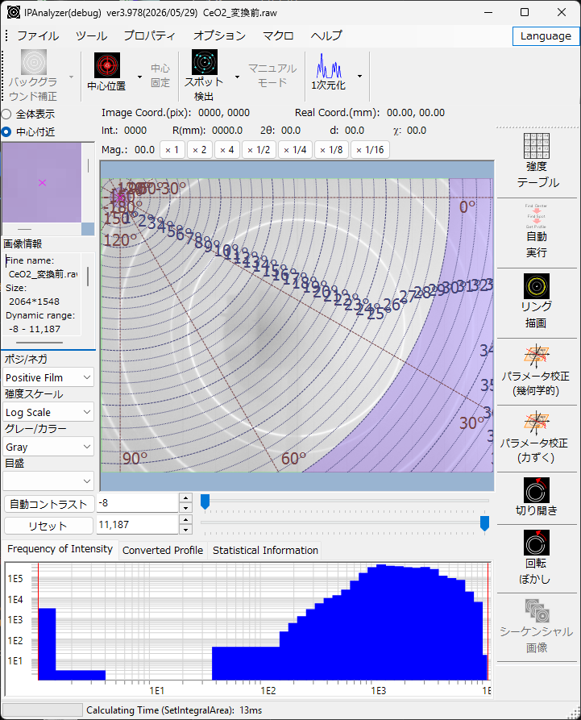

<!-- 260601Cl: 旧 doc と現行コード(FormMain)の検証結果を基にメインウィンドウを再構成。 -->

# メインウィンドウ

メインウィンドウは、IPAnalyzer を起動すると最初に表示される画面です。読み込んだ回折画像の表示、各種演算（中心検索・スポット除外・一次元化）、検出器パラメータの設定への入口がここに集まっています。

画面はおおまかに、上部のメニューとツールバー、中央の画像表示部、右側の縦型ツールバー、下部のグラフ表示部から構成されます。

## 中央画面

### 画像表示部分

読み込んだ画像を表示します。画像上部には、マウスポインタの位置に応じて、実座標 (mm)、画像座標 (pix)、中心からの距離 R (mm)、散乱角 2θ、d 値、方位角 χ、強度が表示されます。マゼンタ（赤紫）色の × 印はダイレクトスポット（中心）位置を表します。

ピクセルの状態は色で区別して表示されます。

| 色 | 意味 |
| --- | --- |
| 水色 | マスクされたスポット |
| 緑色 | 積算対象外領域（Integral Region で設定） |
| 紫色 | 積算対象外の角度領域（Integral Property で設定） |
| 青色 | 閾値強度以下のピクセル（Integral Region で設定） |
| 赤色 | 閾値強度以上のピクセル |

### マウス操作

通常モードでのマウス操作は次のとおりです。

- 左ボタン長押し: その付近のスポット中心を検索します。
- 左ダブルクリック: 中心位置をクリック点へ更新します。
- 右ドラッグ: 範囲を拡大表示します。
- 右クリック: 縮小表示します。

**Manual（マニュアルスポット）モード**のときは、左クリックでマスク、右クリックでマスク解除になります。マスク形状やサイズはツールバーおよびプロパティで設定します。

### 補助画面・画像情報

中央画面の脇には補助表示があります。**全体表示 (Whole image)** と **中心付近 (Near center)** を切り替えられ、全体表示では現在の表示範囲を黄色の枠で、中心付近では拡大像を表示します。

**画像情報 (Image Information)** には、画像の解像度・最大強度・総強度・ヘッダ情報などが表示されます。

### 表示調整部

画像の見え方を調整するコントロール群です。

- **ポジ/ネガ (Gradient)**: 階調の反転。
- **強度スケール (Brightness scale)**: 対数 / 線形。
- **グレー/カラー (Color scale)**: グレースケール / カラー。
- **目盛 (Scale line)**: 目盛線の表示（なし / 粗 / 中 / 細）。
- **自動コントラスト (Auto Contrast)** / **リセット (Reset Contrast)**、および最小・最大強度の指定。
- 表示倍率ボタン（×1, ×2, ×4, ×1/2, ×1/4, ×1/8, ×1/16）。

## 下部画面

下部にはタブで切り替わる 3 つのグラフ／情報があります。

- **強度頻度グラフ (Frequency of Intensity)**: 全ピクセルの強度分布を両対数で表示します。マウスで拡大できます。
- **1次元化プロファイル (Converted Profile)**: 一次元化（Get Profile）実行後の回折プロファイルを表示します。マウスで拡大できます。
- **統計情報 (Statistical Information)**: 選択した矩形領域 (X1,Y1)–(X2,Y2) の統計量を表示します。シーケンシャル画像を読み込んでいる場合は、同じ領域の他フレームの統計も比較表示できます。

## メニュー

メニューバーは **File / Tool / Property / Option / Language / Macro / Help** で構成されます。

### ファイル (File)

- **画像を読込 (Read image)**: 回折画像を開きます。対応形式は[概要](0-overview.md)を参照してください。
- **画像を保存 (Save image)**: TIFF形式 / PNG形式 / CSV形式 / IPA形式 を選んで保存します。TIFF は元のピクセル強度、PNG は表示（明るさ・コントラスト・マスク）を保ったまま、IPA は歪み補正済みの独自形式（メタデータ付き）です。
- **パラメータを読込 / 保存 (Read / Save parameter)**: 波長・カメラ長・ピクセルサイズ・傾き補正・中心位置などを `.prm` ファイルで入出力します。
- **マスク領域を読込 / 保存 / クリア (Read / Save / Clear mask)**: マスクを `.mas` ファイルで入出力、または消去します（マスクは現在の画像と同じ解像度が必要）。
- **閉じる (Close)**。

画像・パラメータ・マスクの各ファイルはウィンドウへのドラッグ＆ドロップでも読み込めます。

### ツール (Tool)

- **Reset Frequency Profile**: 強度頻度グラフを消去します（画像はそのまま）。
- **R-AXIS補正 (Calibrate Raxis Image)**。

### プロパティ (Property)

線源の設定 / 検出器の設定 / 画像範囲の設定 / １次元化の条件 / マスク条件 / １次元化後の処理 / 切り開き画像の設定 / その他。これらは[プロパティウィンドウ](2-property-windows.md)の各タブを直接開きます。

### オプション (Option)

- **ツールチップ (ToolTip)**: ボタンやメニューのツールチップ表示の切り替え。
- **反転 (Flip)**: 水平に反転 / 垂直に反転。**回転 (Rotate)**: 回転角の選択。いずれも表示の操作で、読み込んだ画像データ自体は変更しません。
- **NGEN コンパイル**、**レジストリをクリア** は開発・トラブルシュート用です。

### 言語 (Language)

- **英語 (English)** / **日本語 (Japanese)** を切り替えます（設定はレジストリに保存されます）。

### マクロ (Macro)

- **エディタ (Editor)**: マクロエディタを開きます（[各種ツール](3-tools.md) / [マクロ](5-macro/index.md) を参照）。

### ヘルプ (Help)

- **プログラム更新 (Program Updates)**、**ヒント (Hint)**、**ライセンス (License)**、**バージョン履歴 (Version History)**、**ウェブページ (Web Page)**。

## 演算ツールバー

画像処理の主要操作です（ドロップダウンに詳細オプションがあります）。

- **バックグラウンド (Background)**: バックグラウンド画像の減算（Background Option で設定）。
- **中心位置 (Find Center)**: 2 次元 Pseudo-Voigt フィッティングでビーム中心を検出します（探索範囲は既定 8 px、Miscellaneous で設定）。ドロップダウンにはリングに基づく中心検出もあります。
- **中心を確定 (Fix center)**: 中心位置を固定します。
- **スポット除外 (Mask Spots)**: 平均 ± 標準偏差 × Deviation の基準でスポットを検出してマスクします。ドロップダウンに全マスク・マスク反転・手動などがあります。
- **マニュアル (Manual)**: 手動マスクモード。形状（円 / 矩形）とサイズ（8〜256 px）を指定できます。
- **1次元化 (Get Profile)**: 画像を一次元プロファイルへ積算します。Concentric（2θ 基準）と Radial（方位角基準）に対応します。ドロップダウンで、Integral Property/Region の選択、一次元化前の中心検索・スポット除外の有無、PDIndexer 送信、方位角分割解析、シーケンシャル画像処理などを設定します。

## ツールバー（その他）

右側の縦型ツールバーから各種ツールを起動します。詳細は[各種ツール](3-tools.md)を参照してください。

- **強度テーブル (Intensity Table)**
- **自動手順 (Auto Procedure)**
- **リング描画 (Draw ring)**
- **パラメータ校正 (Find parameter)** / **パラメータ校正 (力ずく) (Find parameter (brute force))**
- **切り開き (Unroll)**
- **回転ぼかし (Circumferential Blur)**
- **シーケンシャル (Sequential)**
