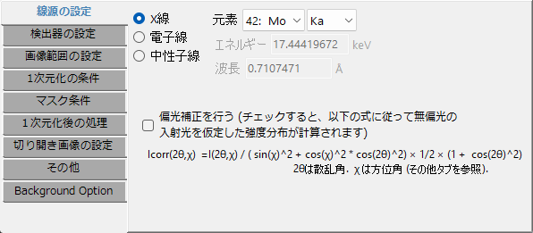
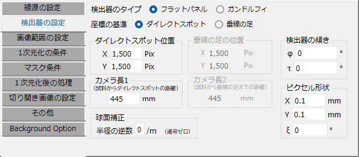
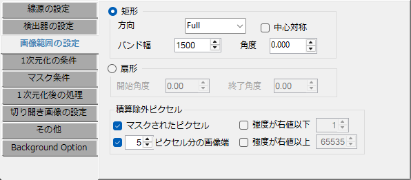
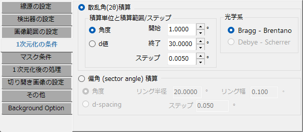
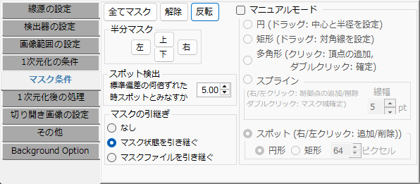
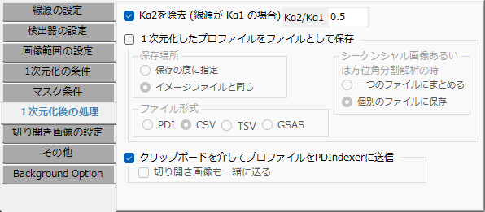
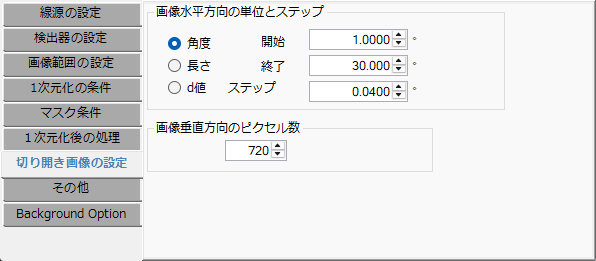
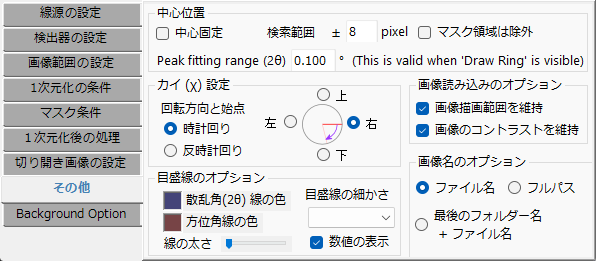
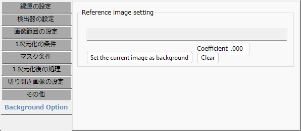

<!-- 260601Cl: 旧 doc と現行コード(FormProperty)の検証結果を基にプロパティウィンドウを再構成。タブUIは英語表示のため英語名を見出しに用い、日本語の補足を併記。260601Cl: 各タブの自動キャプチャ画像を組込。 -->

# プロパティウィンドウ

プロパティウィンドウでは、線源・検出器条件・一次元化の各種条件を設定します。各タブはメインウィンドウの **Property** メニューから直接開くこともできます。

日本語環境では各タブ・コントロールはおおむね日本語化されています（"Background Option" タブなど一部は英語のまま）。以下の見出しは英語タブ名と日本語名を併記し、本文では各タブの設定項目を説明します。

## Wave source（線源の設定）

入射線の種類と波長を設定します。線源は X 線・電子線・中性子線から選べます。X 線では元素と遷移（K 線、L 線など）を選ぶと波長が自動入力され、放射光では波長を直接入力します。電子線・中性子線ではエネルギーまたは波長を入力します（電子線は相対論補正済み）。

- **Correct linear polarization**: 直線偏光の強度を無偏光相当へ補正します（放射光向け）。補正式は次のとおりで、方位角 χ（Miscellaneous タブで定義）と散乱角 2θ に依存します。

$$
I_\text{corr}(2\theta,\chi) = \frac{I(2\theta,\chi)}{\sin^2\chi + \cos^2\chi\,\cos^2 2\theta} \times \frac{1}{2}\left(1 + \cos^2 2\theta\right)
$$

## Detector condition（検出器の設定）

検出器の幾何条件を設定します。旧マニュアルの "IP Condition" に相当し、座標系と検出器形状の選択が加わっています。

- **Coordinates（座標基準）**: **Direct spot**（ダイレクトスポット基準）／ **Foot**（垂線の足基準）。
- **Detector type（検出器形状）**: **Flat panel**（平面検出器）／ **Gandolfi**（ガンドルフィ）。
- **Direct spot position** と **Camera Length 1**: ダイレクトスポット位置 (X, Y pix) と、試料からダイレクトスポットまでの距離 (mm)。
- **Foot position** と **Camera Length 2**: Foot モードのときの垂線の足の位置と、試料から足までの距離。
- **Pixel Shape**: 画素サイズ X, Y (mm) と ξ（Ksi、平行四辺形の歪み角）。
- **Gandolfi Radius**: Gandolfi 形状選択時の半径。
- **Spherical correction**: 球面補正（通常は 0）。
- **Tilt**: IP の傾き φ（Phi）・τ（Tau）。

傾き φ・τ・画素 ξ の定義は[概要](0-overview.md)を参照してください。

## Integral Region（画像範囲の設定）

一次元化の対象とする画像領域を指定します。

- **Rectangle（矩形）**: **Direction** で方向（Full / Top / Bottom / Left / Right / Vertical / Horizontal / Free）を選び、**Band Width**（帯幅）や **Angle**（Free 時の角度）、**Both Side** を設定します。
- **Sector（扇形）**: **Start Angle** / **End Angle** で角度範囲を指定します。
- **Exceptional pixels（積算除外ピクセル）**: **Masked Spots**（マスクしたスポット）、**Under intensity of** / **Over intensity of**（強度の下限・上限）、端から指定ピクセル数 (**pixels from edges**) を除外します。

## Integral Property（１次元化の条件）

一次元化の方式と刻みを設定します。

- **Concentric integration（同心円積分・散乱角分散）**: 横軸の単位を **Angle**（2θ, °）／ **Length**（mm）／ **d-spacing**（Å）から選び、**Start / End / Step** を指定します。**Output pattern** は **Bragg - Brentano** または **Debye - Scherrer** を選べます。
- **Radial integration (cake pattern)（円周方向積分）**: リング状領域を円周方向に分割して解析します。横軸を **Angle** / **d-spacing** から選び、**Donut radius**（中心半径）・**Donut width**（環の幅）・**Sector angle step**（掃引ステップ）を指定します。

## Mask Option（マスク条件）

マスクと中心・スポット検出の条件を設定します（旧マニュアルの "Find Center & Spots" を拡張）。

- **Half mask**: 画像の上下左右半分を素早くマスクするボタン（Top / Bottom / Left / Right）。
- **Manual mask mode**: メイン画像上での対話的マスクを有効にします。形状は **Circle**（ドラッグで中心と半径）／ **Polygon**（クリックで頂点追加）／ **Rectangle**（対角ドラッグ）／ **Spline curve**（曲線）／ **Spot**（左右クリックでスポット追加・削除）。
- **Takeover（引き継ぎ）**: 画像読込時のマスクの扱い（**None** / **Take over the current mask state** / **Take over the mask file**）。
- **Find Spots** の **Deviation**: スポット検出の統計しきい値。
- **Find Center**: 中心検出の探索範囲など。

## After "Get Profile"（１次元化後の処理）

一次元化後の保存と送信を設定します。

- **Save File**: 保存先を「画像と同じディレクトリ」または「毎回選択」から選び、形式を **PDI** / **CSV** / **TSV** / **GSAS** から選びます。
- **Send PDIndexer**: クリップボード経由で、起動中の PDIndexer へプロファイルを送信します。

## Unrolled Image Option（切り開き画像の設定）

切り開き（Unroll）展開画像のパラメータを設定します。

- **横方向**: 単位（Angle / Length / d-spacing）と **Start / End / Step**。出力画像の幅 ≈ (End − Start) / Step。
- **縦方向**: 方位角ステップ（°/pixel）。出力画像の高さ ≈ 360 / step。

切り開きは、ダイレクトスポットを中心とする極座標の回折像を、直交座標（角度・距離）の画像へ展開します。

## Miscellaneous（その他）

表示や座標の細かな設定をまとめたタブです。

- **画像名の表示**: ファイル名のみ / 親フォルダ＋ファイル名 / フルパス。
- **コントラスト・強度範囲の保持**: 画像読込時に表示設定を引き継ぐかどうか。
- **方位角 χ（Chi）の向き**: 基準位置（Top / Bottom / Left / Right）と回転方向（Clockwise / Counterclockwise）。χ は偏光補正や円周方向積分で参照されます。
- **目盛線**: 色・太さ・分割数・ラベル表示。
- **Find Center**: 探索範囲、ピークフィッティング範囲、中心固定、マスクピクセルの除外。

## Background Option

バックグラウンド画像による補正を設定します。

- **バックグラウンド画像**: 現在表示している画像をバックグラウンドに設定（**Set the current image as background**）、または消去（**Clear**）します。
- **係数**: バックグラウンド画像に掛ける係数。
- **端のマスク**: 補正時に端へ追加するマスク量（px）。

フラットフィールド補正や空気散乱の除去などに用います。

