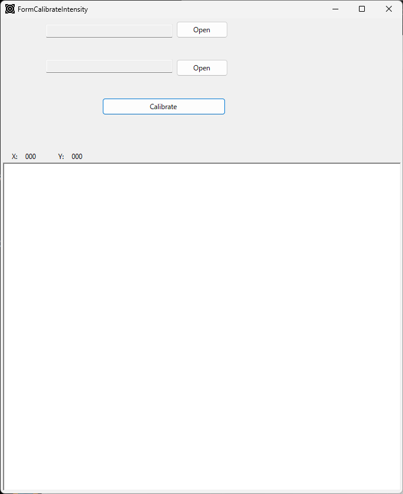
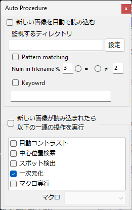
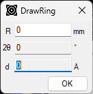
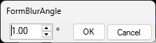
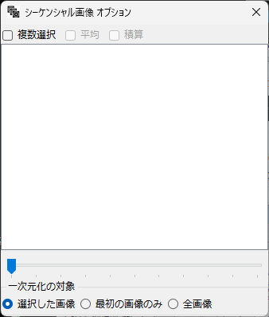
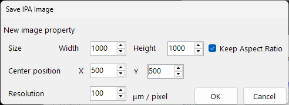
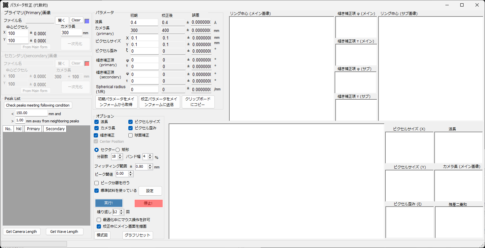
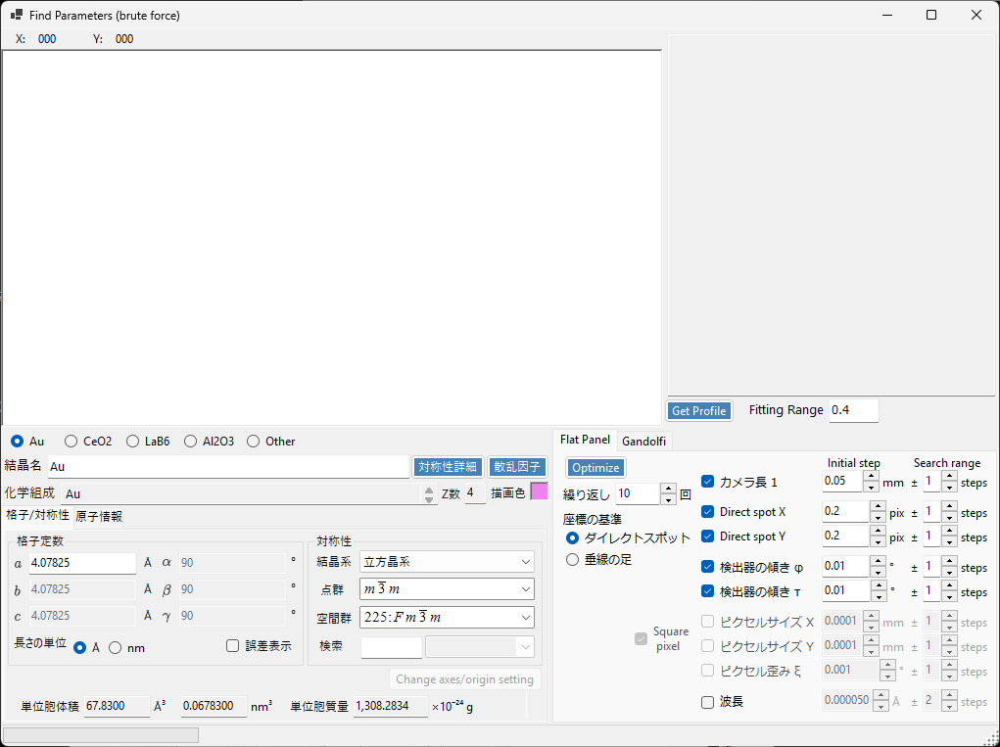
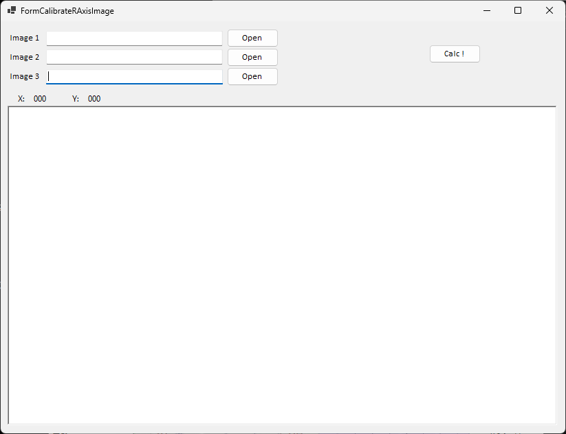

<!-- 260601Cl: 旧 doc と現行コード(各ツールフォーム/Macro)の検証結果を基に各種ツールを再構成。260601Cl: 自動キャプチャ画像を組込。 -->

# 各種ツール

メインウィンドウ右側の縦型ツールバーやメニューから起動する補助ツールを説明します。パラメータ校正やマクロを使った具体的な作業手順は[実際の手順](4-procedures.md)を参照してください。

## 強度テーブル (Intensity Table)

2 枚の画像の強度分布を比較し、強度変換テーブルを最適化するツールです。16 個の制御点を 300 回反復で最適化し、総積算強度を保ったまま 2 枚の強度を一致させます。検出器の強度応答の校正などに用います。

## 自動手順 (Auto Procedure)

フォルダを監視して新しい画像を自動で読み込み、読込後に一連の処理を自動実行するツールです。

- **監視と自動読込**: 指定フォルダ（サブフォルダ含む）を監視し、ファイルの書き込み完了を待ってから読み込みます。ファイル名による絞り込み（ナンバーマッチング・キーワード）が可能です。
- **自動実行**: 自動コントラスト → 中心位置検索 → スポット検出 → 一次元化 → マクロ実行 のうち、チェックした手順を順に実行します。

実験中に出力フォルダを監視し、画像が届くたびに自動で一次元化する、といった使い方ができます。詳細は[実際の手順](4-procedures.md)を参照してください。

## リング描画 (Draw Ring)

指定した距離・角度・d 値のリングを、IP の傾きや画素歪みを考慮して画像上に描きます。**R (mm)** / **2θ (°)** / **d (Å)** のいずれかをクリックして編集対象を選ぶと、残りは波長・カメラ長から自動計算されます。

## 切り開き (Unroll)

回折像を、ダイレクトスポットを中心とする極座標から直交座標（横軸＝角度・距離・d 値、縦軸＝方位角）へ展開します。現在は専用ウィンドウではなく、ツールバーの **切り開き (Unroll)** ボタンとプロパティの **Unrolled Image Option** タブで設定します。展開には一次元化と同じサブピクセル強度分配アルゴリズムを使います。

## 回転ぼかし (Circumferential Blur)

リングパターンを円周（方位角）方向にぼかすツールです。ぼかし角を 1 つ指定して適用します。

## シーケンシャル (Sequential Image)

マルチフレーム画像（HDF5 など、時系列・温度系列・放射光エネルギースキャン）を扱うツールです。

- フレーム一覧から 1 枚を選んで表示、またはトラックバーで送ります。
- **複数選択**で複数フレームを選び、**平均**または**合計**を計算できます。
- 一次元化の対象を「全フレーム / 選択フレーム / 最前面のみ」から選べます。
- フレームごとにエネルギー情報があれば波長を自動更新します。

## 画像保存（IPA 形式）

IP の傾き φ・τ と画素歪み ξ を補正し、正方形画素・指定解像度の画像として保存します。カメラ長・波長・中心位置などのメタデータも書き込まれ、幾何情報を保ったまま他の画像処理に渡せます。

## パラメータ校正（幾何学的）

標準物質の回折リングから、波長・カメラ長・画素サイズ・画素歪み・傾き（φ, τ）を最適化するツールです。Primary / Secondary の 2 枚のパターンを使い、ピークを選んで **Refine!** で最適化します。収束の様子（楕円中心・残差）はグラフで確認できます。具体的な手順は[実際の手順](4-procedures.md)を参照してください。

## パラメータ校正（力ずく）

カメラ長と波長を、勾配法ではなく総当たり（グリッド探索）で求めるツールです。不完全なリングやノイズの多いデータなど、幾何学的最適化が収束しにくい場合に有効です。結晶パラメータの入力には CrystalControl を使います。詳しい手順は[パラメータ校正（力ずく）](6-find-parameter.md)を、全体の流れは[実際の手順](4-procedures.md)を参照してください。

## マクロ

Python ライクなスクリプトで操作を自動化する機能です。メインウィンドウの **Macro → Editor** メニューからマクロエディタを開きます。

- `for` / `if` / `while` / `def` / `class` や算術・`math` モジュールが使えます。
- `IPA.File` / `IPA.Wave` / `IPA.Detector` / `IPA.Profile` / `IPA.Sequential` / `IPA.Image` / `IPA.Mask` / `IPA.PDI` / `IPA.IntegralProperty` などの API で各操作を呼べます。
- サンプルマクロ（基本ループ・幾何設定・一括処理・方位角分割・マスク・PDIndexer 送信など）が同梱され、ステップ実行で変数を確認できます。

関数の一覧と使用例は[マクロ](5-macro/index.md)を、マクロを使った手順例は[実際の手順](4-procedures.md)を参照してください。

## R-AXIS 補正 (Calibrate R-Axis Image)

R-Axis 検出器固有の強度補正を意図したツールですが、現状はファイル読み込みのみで、補正処理は未実装です。

