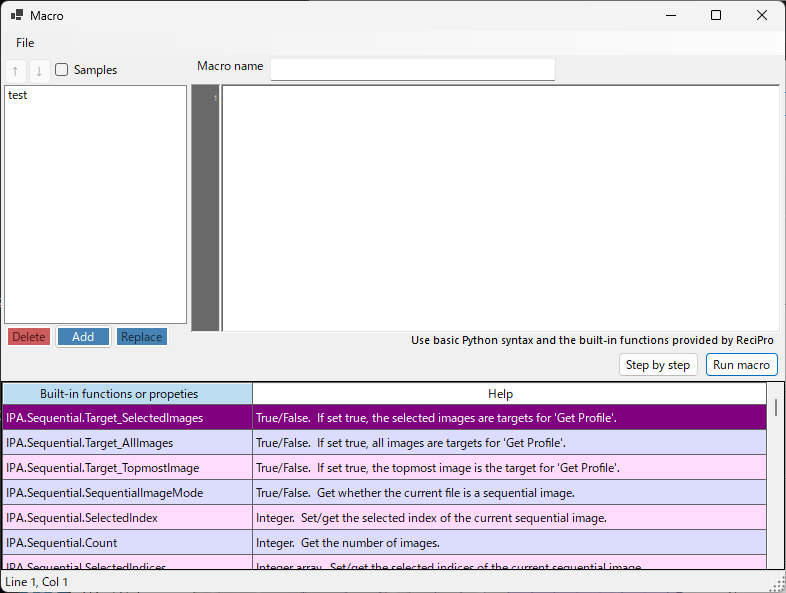

<!-- 260601Cl 追加: Wiki の List-of-macro-functions / Macro-examples を Pages へ移行する際の親ページ。 -->

# マクロ

IPAnalyzer は、Python ライクなスクリプトで一連の操作を自動化する**マクロ**機能を備えています。複数ファイルの一括一次元化や、フォーマット変換、方位角分割解析など、繰り返しの多い作業を自動化できます。

## エディタの開き方

メインウィンドウの **Macro** メニュー → **Editor** からマクロエディタを開きます。エディタでコードを編集し、実行・ステップ実行ができます。

## 言語仕様

- `for` / `if` / `while` / `def` / `class` などの制御構文と算術演算が使えます。
- `math` モジュールは事前に import 済みで、`import` 文なしに `math.pi` や `math.sin(...)` を直接使えます。
- `print()` は使えません。値の確認は**ステップ実行**（Step by step）で行い、デバッグパネルで変数の変化を観察します。
- 各 IPAnalyzer の操作は、`IPA` ルートオブジェクト配下の名前空間（`IPA.File` など）から呼び出します。

## IPA 名前空間

| 名前空間 | 役割 |
|------|------|
| `IPA.File` | 画像・パラメータ・マスクファイルの読み書き、ファイル選択ダイアログ |
| `IPA.Wave` | 入射線源・波長の設定 |
| `IPA.Detector` | 中心位置・カメラ長・画素サイズ・傾きなど検出器幾何の設定 |
| `IPA.Image` | 表示スケール・コントラスト・表示範囲の制御 |
| `IPA.Mask` | スポット・領域のマスク操作 |
| `IPA.Profile` | 一次元化（Get Profile）の実行と保存・送信の設定 |
| `IPA.IntegralProperty` | 同心円／偏角積算の範囲・ステップ・単位の設定 |
| `IPA.Sequential` | マルチフレーム画像のフレーム選択・平均・対象指定 |
| `IPA.PDI` | PDIndexer 側マクロの呼び出し（クリップボード連携） |

各メンバーの一覧は[組み込み関数](1-built-in-functions.md)を、具体的なスクリプト例は[使用例](2-examples.md)を参照してください。

!!! tip "エディタ内ヘルプが最新の正本です"
    各関数・プロパティの説明はマクロエディタ内のヘルプに表示され、これがバージョンに追従した最新の正本です。本ページの一覧と食い違う場合はエディタ内ヘルプを優先してください。

## サンプルマクロ

エディタの保存済みマクロが空の場合、基本ループ・数学関数・幾何設定・一括処理・方位角分割・マスク・PDIndexer 送信などのサンプルマクロが自動的に挿入されます。これらを出発点に書き換えていくのが簡単です。

## 自動実行との連携

ユーザーが書いたマクロは名前を付けて保存でき、[Auto Procedure](../3-tools.md) の「読み込み後に実行」からも呼び出せます。実験中に届く画像へ自動でマクロを適用する、といった使い方ができます。
