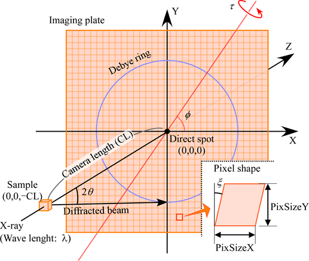

<!-- 260602Cl: 旧 doc/IPAnalyzerAlgorithm.pdf §1 を基に作成（リード言語: 日本語）。回転行列は Rodrigues で再導出し検算済み。 -->

# Appendix A1. 検出器の幾何と座標変換

このページでは、IPAnalyzer が平面検出器（IP・CCD/CMOS）上の画素位置と回折角を対応づけるために用いる **座標系・IP の傾き補正・画素形状補正** を数式で定義します。座標系の概観は [付録トップ](index.md) と [0. 概要](../0-overview.md) も参照してください。

---

## 座標系とパラメータ

IPAnalyzer は内部で一貫して **右手系** を採用します。

- X 線あるいは電子線が IP と交わる点（**ダイレクトスポット**）を原点 $(0,0,0)$ とし、$Z$ 軸をビームの進行方向に一致させます。
- サンプルを無限小とみなしたときの、サンプルと原点との距離を **カメラ長** $\mathrm{CL}$ と定義します。したがってサンプル位置は $(0,\ 0,\ -\mathrm{CL})$ です。
- $X$ 軸は、IP が傾いていないときの読み取りレーザーの走査方向（画像の右方向）に一致させます。よって $Y$ 軸は画面下向きになります。
- 円錐角 $2\theta$ の回折リングは、傾きのない $XY$ 平面上では半径 $\mathrm{CL}\tan 2\theta$ の真円として観察されます。

{width=520px}

3 次元物体の自由回転には本来 3 軸が必要ですが、デバイ環の分布は $Z$ 軸まわりの回転に対して不変なので、$X$ 軸を恣意的に選ぶことができます。このため自由度が 1 つ減り、IP の傾きは **2 つの変数** $\varphi,\ \tau$ で表現できます。

!!! note "(WIN)PIP との対応"
    旧ソフト PIP では傾きを別の角度 $(\beta,\ \Phi)$ で表します。$(\beta,\ \Phi)$ から IPAnalyzer の $(\varphi,\ \tau)$ への変換は $(\beta,\ \Phi)\rightarrow(270^\circ-\beta,\ \Phi)$ です。詳細は [0. 概要](../0-overview.md) の「(WIN)PIP との関係」を参照してください。

---

## IP の傾き補正

IP の光軸（$Z$ 軸）に対する傾きは、原点を通り $XY$ 平面上にある直線を回転軸とする回転で表します。この回転は、$Z$ 軸まわりに $\varphi$ 回した軸（$R_2$）に沿って $\tau$ だけ回す（$R_1$）操作として、回転行列 $R = R_2\,R_1\,R_2^{-1}$ で書けます。

$$
R_2 = \begin{pmatrix} \cos\varphi & -\sin\varphi & 0 \\ \sin\varphi & \cos\varphi & 0 \\ 0 & 0 & 1 \end{pmatrix},
\qquad
R_1 = \begin{pmatrix} 1 & 0 & 0 \\ 0 & \cos\tau & -\sin\tau \\ 0 & \sin\tau & \cos\tau \end{pmatrix}
$$

これは、$XY$ 平面内で $X$ 軸と角 $\varphi$ をなす単位ベクトル $\mathbf{n} = (\cos\varphi,\ \sin\varphi,\ 0)$ を軸とする角 $\tau$ の回転に等しく、展開すると

$$
R = R_2\,R_1\,R_2^{-1} =
\begin{pmatrix}
\cos^2\varphi + \cos\tau\,\sin^2\varphi & \cos\varphi\sin\varphi\,(1-\cos\tau) & \sin\varphi\sin\tau \\
\cos\varphi\sin\varphi\,(1-\cos\tau) & \cos^2\varphi\,\cos\tau + \sin^2\varphi & -\cos\varphi\sin\tau \\
-\sin\varphi\sin\tau & \cos\varphi\sin\tau & \cos\tau
\end{pmatrix}
$$

となります。

### 順変換（傾きのない面 → 傾いた IP）

傾きのない $XY$ 平面上の点 $P_1 = (X,\ Y,\ 0)$ は、傾いた IP 上では $P_2 = R\,P_1$ に写ります。

$$
P_2 =
\begin{pmatrix}
X\,(\cos^2\varphi + \cos\tau\sin^2\varphi) + Y\,\cos\varphi\sin\varphi\,(1-\cos\tau) \\
X\,\cos\varphi\sin\varphi\,(1-\cos\tau) + Y\,(\cos^2\varphi\cos\tau + \sin^2\varphi) \\
-X\,\sin\varphi\sin\tau + Y\,\cos\varphi\sin\tau
\end{pmatrix}
$$

### 射影（傾いた IP → 傾きのない面）

実際に必要なのは逆向き、すなわち「傾いた IP 上で観測された画素」が、傾きがなければ受け持つはずの $XY$ 平面上の座標です。これは、傾いた IP 上の点とサンプル $(0,0,-\mathrm{CL})$ を結ぶ直線が $XY$ 平面と交わる点 $P_3$ を求める **中心投影（透視投影）** で与えられます。サンプルを投影中心とする射影変換なので、

$$
P_3 = \frac{\mathrm{CL}}{\mathrm{CL} + (P_2)_z}\,\big((P_2)_x,\ (P_2)_y,\ 0\big)
$$

の形にまとまります。傾き補正全体は線形（同次座標では射影）変換なので、各画素の位置をコンピュータ上で高速に計算できます。

---

## 画素形状の補正

IP の画素形状は、$X$ 軸方向の長さ $\mathrm{PixSizeX}$、$Y$ 軸方向の長さ $\mathrm{PixSizeY}$、および直角からのずれ（歪み角）$\xi$ をもつ **平行四辺形** として扱います。$\xi \neq 0$ は、読み取りレーザーのスキャン開始点の位置にずれがあることを意味し、本ソフトではこのずれは $Y$ 軸方向に対して一定であると仮定します。

中心画素から数えて $X$ 方向に $\mathrm{PixNumX}$、$Y$ 方向に $\mathrm{PixNumY}$ だけ離れた画素の実座標 $P$ は、

$$
P =
\begin{pmatrix} \mathrm{PixSizeX} & \mathrm{PixSizeY}\,\sin\xi & 0 \\ 0 & \mathrm{PixSizeY} & 0 \\ 0 & 0 & 1 \end{pmatrix}
\begin{pmatrix} \mathrm{PixNumX} \\ \mathrm{PixNumY} \\ 0 \end{pmatrix}
=
\begin{pmatrix} \mathrm{PixNumX}\cdot\mathrm{PixSizeX} + \mathrm{PixNumY}\cdot\mathrm{PixSizeY}\,\sin\xi \\ \mathrm{PixNumY}\cdot\mathrm{PixSizeY} \\ 0 \end{pmatrix}
$$

で与えられます。この画素形状補正と、上で述べた傾き補正を組み合わせることで、傾いた IP 上の任意の画素を、傾きのない $XY$ 平面上の正しい位置へ対応づけられます。この対応づけが、次章のパラメータ決定と [A3. 画像の積算](a3-image-integration.md) の前提になります。
