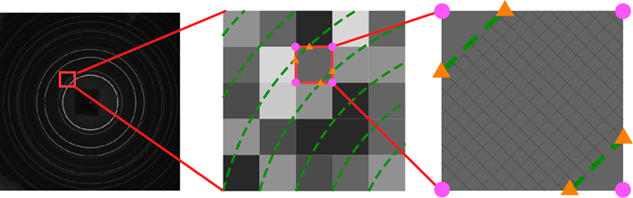

<!-- 260602Cl: 旧 doc/IPAnalyzerAlgorithm.pdf §3 を基に作成（リード言語: 日本語）。 -->

# Appendix A3. 画像の積算

2 次元画像を 1 次元プロファイルへ変換するときの最大の問題は、**積算の角度ステップ間隔が画素間隔（画素サイズ）より小さい場合に、複数のステップにまたがる画素の強度を各ステップへどう配分するか** という点です。IPAnalyzer は、この配分を **面積分配法** で行います。

---

## 面積分配法

本ソフトでは、ステップを区切る線（等回折角の境界）と画素との交点を計算し、各ステップに含まれる画素の **面積** を求めて、その面積に比例して強度を配分します。

{width=680px}

この方法には次の特徴があります。

- 各画素の内部ではステップ境界の円弧を **直線として近似** します。これは計算速度のための処置であり、実用上はほとんど問題になりません。
- [A1. 検出器の幾何](a1-geometry.md) の傾き補正・画素形状補正が必要なとき、画素の形状は厳密には正方形になりません。そこで本ソフトでは画素の **四隅の座標を逐次計算** し、四角形（一般には平行四辺形）の形として面積を求めます。

この方式により、原理的には角度ステップをどれだけ細かくしても、画素強度は各ステップへ滑らかに配分されます。

---

## 適用範囲

同一の面積分配アルゴリズムは、次の 3 種類の積算すべてに用いられています。

| 機能 | 積算の方向 | 用途 |
|------|-----------|------|
| **Concentric Integration** | 回折角（同心円方向） | 通常の $2\theta$–強度プロファイルの作成。 |
| **Radial Integration** | 円周（方位角）方向 | リングの方位角依存性（配向・歪み）の評価。 |
| **Unrolled Image** | 回折角 × 方位角 | リングを切り開いた 2 次元展開像の作成。 |

各機能の操作方法は [3. 各種ツール](../3-tools.md) を参照してください。
