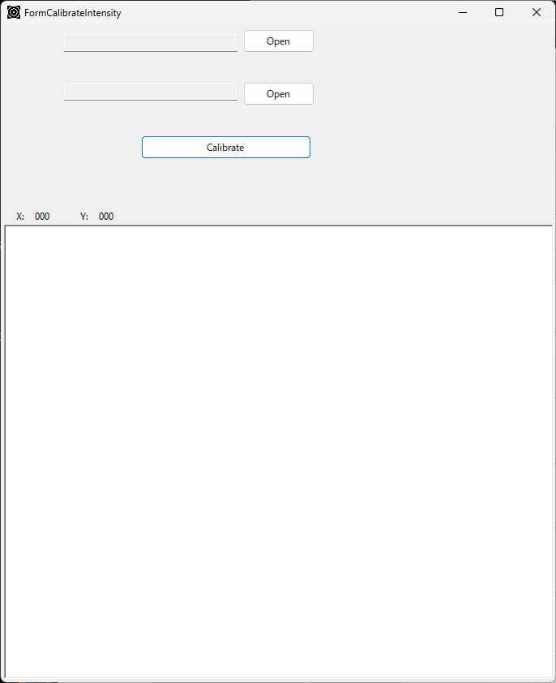
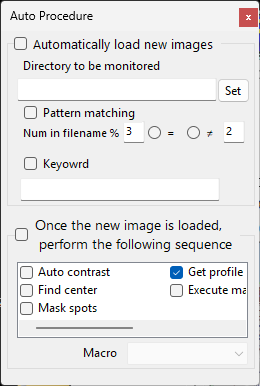
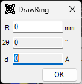
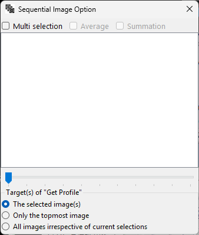
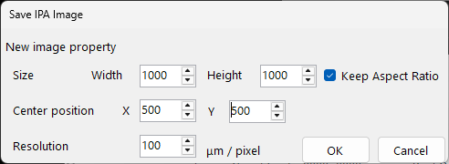
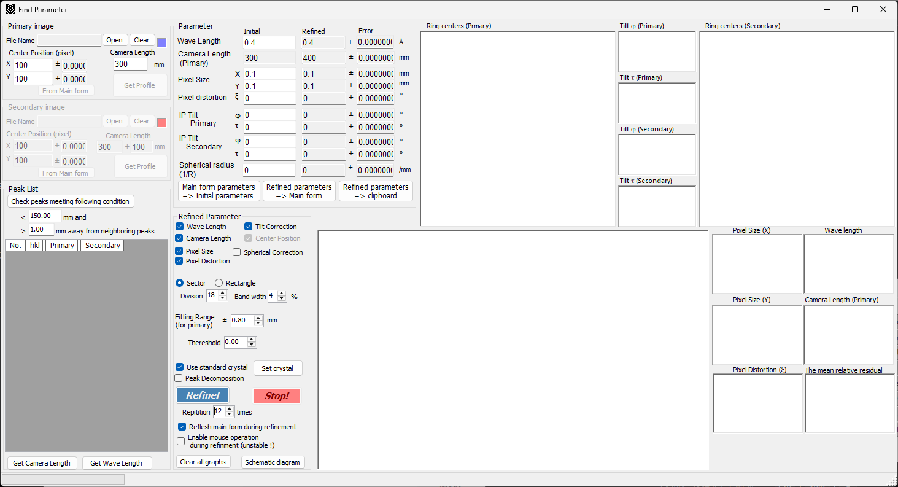
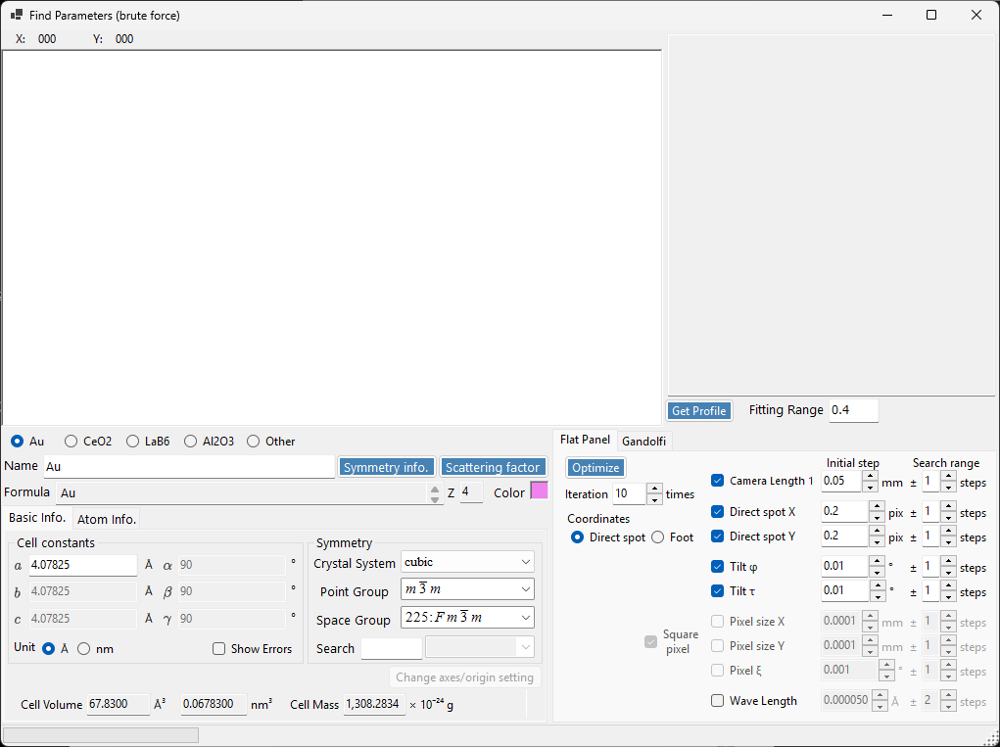
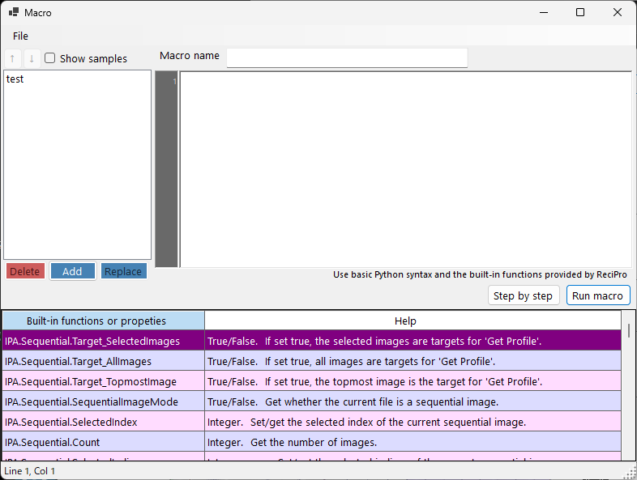
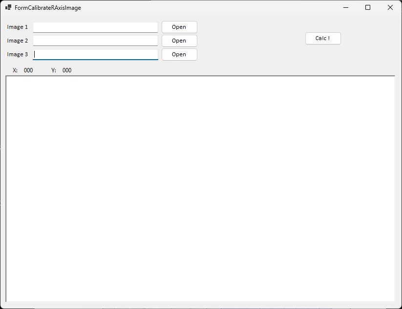

<!-- 260601Cl: Reflected from ja/3-tools.md (lead language: Japanese). 260601Cl: auto-capture images embedded. -->

# Tools

이 페이지에서는 메인 창 오른쪽의 세로 도구 모음이나 메뉴에서 실행하는 보조 도구에 대해 설명합니다. 매개변수 보정과 매크로를 사용하는 구체적인 절차는 [Procedures](4-procedures.md)를 참조하십시오.

## Intensity Table

두 이미지의 강도 분포를 비교하여 강도 변환 테이블을 최적화하는 도구입니다. 총 적분 강도를 보존하면서 두 강도를 일치시키기 위해 16개의 제어점을 300회 반복하여 최적화합니다. 예를 들어 검출기의 강도 응답을 보정하는 데 사용됩니다.

## Auto Procedure

폴더를 감시하여 새 이미지를 자동으로 불러오고, 불러온 후 일련의 작업을 실행하는 도구입니다.

- **Watch and auto-load**: 지정한 폴더(하위 폴더 포함)를 감시하여 파일의 쓰기가 완료된 후 해당 파일을 읽어 들입니다. 파일은 이름(번호 일치, 키워드)으로 필터링할 수 있습니다.
- **Auto execution**: Auto Contrast → Find Center → Mask Spots → Get Profile → Execute Macro 중에서 체크한 단계를 순서대로 실행합니다.

이를 통해 실험 중 출력 폴더를 감시하면서 도착하는 각 이미지를 자동으로 적분하는 등의 용도로 사용할 수 있습니다. 자세한 내용은 [Procedures](4-procedures.md)를 참조하십시오.

## Draw Ring

IP 기울기와 픽셀 왜곡을 고려하여 이미지 위의 지정한 거리, 각도 또는 d 값에 고리를 그립니다. **R (mm)** / **2θ (°)** / **d (Å)** 중 하나를 클릭하여 편집할 값을 선택하면, 나머지는 파장과 카메라 길이로부터 자동으로 계산됩니다.

## Unroll

회절 이미지를 다이렉트 스폿을 중심으로 한 극좌표에서 직교 좌표(가로축 = 각도, 거리 또는 d 값; 세로축 = 방위각)로 펼칩니다. 현재는 전용 창이 아니라 **Unroll** 도구 모음 버튼과 속성의 **Unrolled Image Option** 탭으로 설정합니다. 펼치기에는 1차원화와 동일한 서브픽셀 강도 분포 알고리즘이 사용됩니다.

## Circumferential Blur

고리 패턴을 원주(방위각) 방향으로 블러 처리하는 도구입니다. 단일 블러 각도를 지정하여 적용합니다.

## Sequential Image

다중 프레임 이미지(HDF5 등; 시계열, 온도 계열, 싱크로트론 에너지 스캔)를 다루는 도구입니다.

- 프레임 목록에서 단일 프레임을 선택하여 표시하거나, 트랙바로 단계적으로 이동할 수 있습니다.
- **multi-selection**으로 여러 프레임을 선택하여 그 **average** 또는 **sum**을 계산합니다.
- 1차원화의 대상은 "all frames / selected frames / topmost only" 중에서 선택할 수 있습니다.
- 각 프레임이 에너지 정보를 가지고 있으면 파장이 자동으로 갱신됩니다.

## Save Image (IPA format)

IP 기울기 φ, τ와 픽셀 왜곡 ξ를 보정하고, 지정한 해상도에서 정사각형 픽셀로 이미지를 저장합니다. 카메라 길이, 파장, 중심 위치 등의 메타데이터도 함께 기록되므로, 기하 정보를 보존한 채로 이미지를 다른 이미지 처리에 넘길 수 있습니다.

## Find Parameter (Geometric)

표준 물질의 회절 고리로부터 파장, 카메라 길이, 픽셀 크기, 픽셀 왜곡 및 기울기(φ, τ)를 최적화하는 도구입니다. Primary와 Secondary 두 패턴을 사용하며, 피크를 선택하고 **Refine!**으로 최적화합니다. 수렴(타원 중심, 잔차)은 그래프에서 확인할 수 있습니다. 구체적인 단계는 [Procedures](4-procedures.md)를 참조하십시오.

## Find Parameter (Brute force)

기울기법이 아니라 전수 격자 탐색으로 카메라 길이와 파장을 찾는 도구입니다. 불완전한 고리나 노이즈가 많은 데이터처럼 기하 최적화가 수렴하기 어려운 경우에 효과적입니다. 결정 매개변수 입력에는 CrystalControl이 사용됩니다. 자세한 단계는 [Find Parameter (brute force)](6-find-parameter.md)를, 작업 흐름은 [Procedures](4-procedures.md)를 참조하십시오.

## Macro

Python과 유사한 스크립트로 작업을 자동화하는 기능입니다. 메인 창의 **Macro → Editor** 메뉴에서 매크로 편집기를 엽니다.

- `for` / `if` / `while` / `def` / `class`, 산술 연산 및 `math` 모듈을 사용할 수 있습니다.
- `IPA.File` / `IPA.Wave` / `IPA.Detector` / `IPA.Profile` / `IPA.Sequential` / `IPA.Image` / `IPA.Mask` / `IPA.PDI` / `IPA.IntegralProperty` 등의 API를 통해 각 작업을 호출할 수 있습니다.
- 샘플 매크로(기본 루프, 기하 설정, 일괄 처리, 방위각 분할, 마스킹, PDIndexer로 전송 등)가 함께 제공되며, 단계 실행으로 변수를 확인할 수 있습니다.

전체 함수 레퍼런스와 예제는 [Macro](5-macro/index.md)를, 매크로 기반 작업 흐름은 [Procedures](4-procedures.md)를 참조하십시오.

## Calibrate R-Axis Image

R-Axis 검출기 고유의 강도 보정을 위한 도구입니다. 현재는 파일을 읽어 들이기만 하며, 보정 자체는 아직 구현되지 않았습니다.

