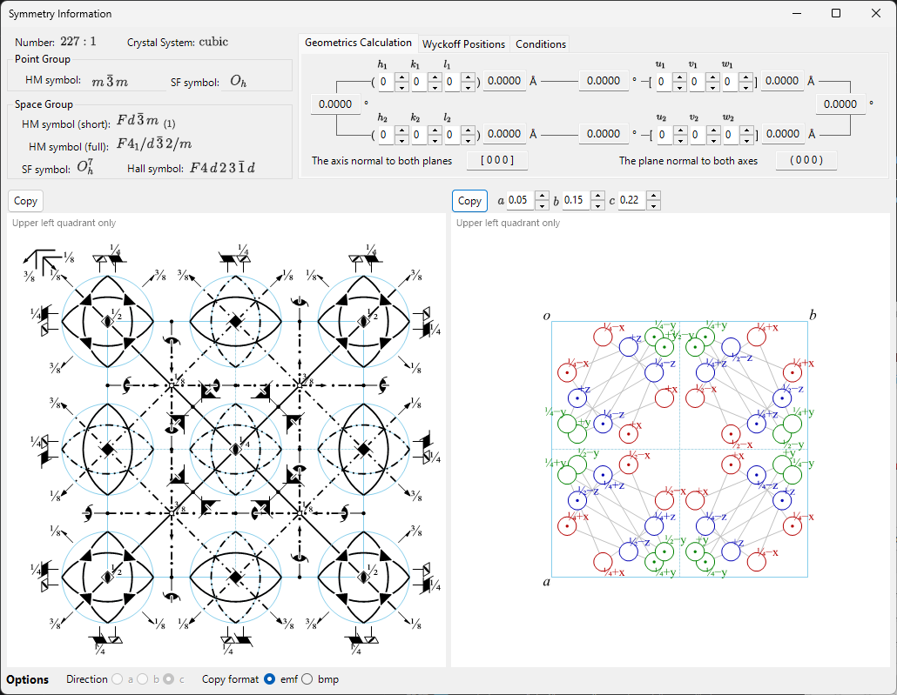
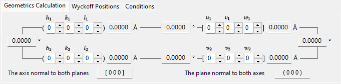
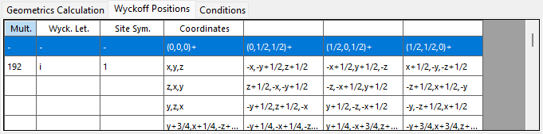
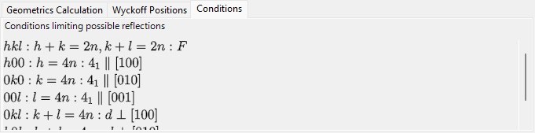

<!-- 260605Cl: Ported from ReciPro docs/src/en/2-symmetry-information.md into the IPAnalyzer appendix (reflected from ja/appendix/a4). The Symmetry Information window is a shared Crystallography.Controls component, identical to ReciPro. -->

# Apêndice A4. Symmetry Information

A janela **Symmetry Information** exibe informações detalhadas sobre a simetria do grupo espacial do cristal selecionado e, além disso, gera diagramas esquemáticos dos elementos de simetria e das posições gerais no estilo do *International Tables for Crystallography* Vol. A.

No IPAnalyzer, esta subjanela é aberta a partir da **Crystal window** (o CrystalControl usado em [4. Procedimentos práticos](../4-procedures.md) para a calibração geométrica e em [6. Encontrar parâmetros (força bruta)](../6-find-parameter.md)).

A janela divide-se em uma área de identidade do grupo espacial (canto superior esquerdo), uma área de cálculo/tabela com abas (canto superior direito) e dois diagramas esquemáticos (parte inferior).

---

## Atalhos de teclado e mouse

Esta janela não possui combinações especiais de teclas ou mouse. <kbd>F1</kbd> abre esta página do manual, e os dois botões **Copy** colocam o diagrama de elementos de simetria e o diagrama de posições gerais na área de transferência (como bitmap, ou como EMF vetorial quando **EMF** está marcado).

---

## Identidade do grupo espacial

O painel superior esquerdo lista, para o grupo espacial atual:

- **Number** (1–230) e o índice de configuração (setting)
- **Crystal System**
- **Point Group** : símbolos de Hermann–Mauguin (HM) e Schoenflies (SF)
- **Space Group** : símbolo curto HM, símbolo completo HM, símbolo SF e **Hall symbol**

---

## Geometrics Calculation

Insira dois planos cristalinos \((h_1, k_1, l_1)\), \((h_2, k_2, l_2)\) ou dois índices de direção \([u_1, v_1, w_1]\), \([u_2, v_2, w_2]\) para obter:

- o d-spacing de cada plano / o comprimento de cada eixo,
- o ângulo entre os dois planos (ou dois eixos),
- **o índice de direção normal a ambos os planos** e **o índice de plano normal a ambos os eixos**.

Esses cálculos respeitam a métrica da célula unitária atual.

---

## Wyckoff Positions

Lista todas as posições de Wyckoff com sua multiplicidade, letra de Wyckoff, simetria de sítio e se é uma posição geral ou especial. Para redes centradas, os vetores de translação da rede são mostrados na linha de cabeçalho.

---

## Conditions

As condições de reflexão decorrentes da centragem da rede e dos operadores de simetria de deslizamento (glide) / parafuso (screw).

---

## Diagramas de elementos de simetria e de posições gerais

Os dois painéis na parte inferior reproduzem os diagramas esquemáticos de simetria do grupo espacial na notação do *International Tables for Crystallography* Vol. A.

- **Elementos de simetria (esquerda)**: eixos de rotação/parafuso (screw), planos de espelho/deslizamento (glide) e centros de inversão/pontos de rotoinversão são desenhados com os símbolos gráficos convencionais.
  - Para a rede \(F\) do sistema cúbico, apenas um oitavo da célula unitária (somente o quadrante superior esquerdo) é mostrado.
- **Posições gerais (direita)**: as posições equivalentes gerais são plotadas como círculos (uma vírgula denota uma imagem especular), anotadas com suas coordenadas fracionárias.
  - Somente para o sistema cúbico, linhas auxiliares conectam os três círculos relacionados por um eixo de rotação de ordem três.

Controles abaixo dos diagramas:

- **Direction** (`a` / `b` / `c`) : escolha o eixo cristalino ao longo do qual projetar.
- **Copy** cada diagrama para a área de transferência como imagem vetorial (**EMF**) ou imagem rasterizada (**BMP**); o EMF pode ser desagrupado e editado no PowerPoint.

---

## Veja também

- [Topo do apêndice](index.md)
- [4. Procedimentos práticos](../4-procedures.md) — calibração de parâmetros geométricos usando um cristal de referência.
- [6. Encontrar parâmetros (força bruta)](../6-find-parameter.md)
