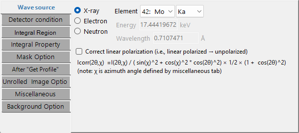
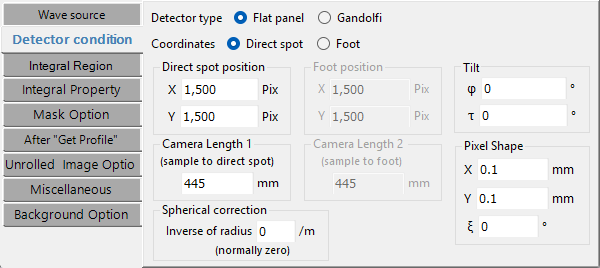
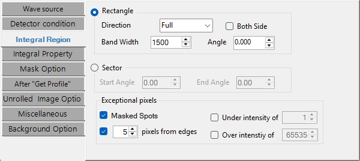
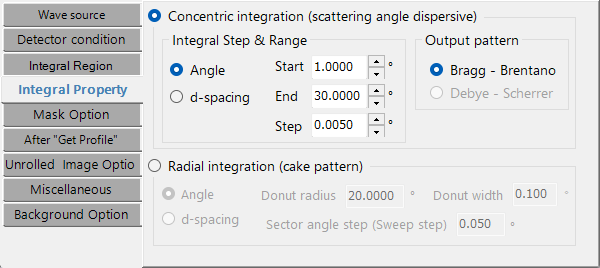
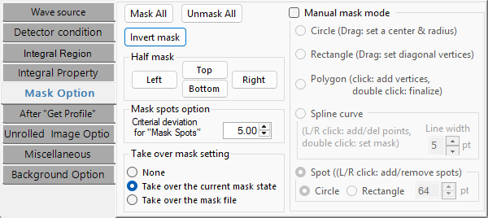
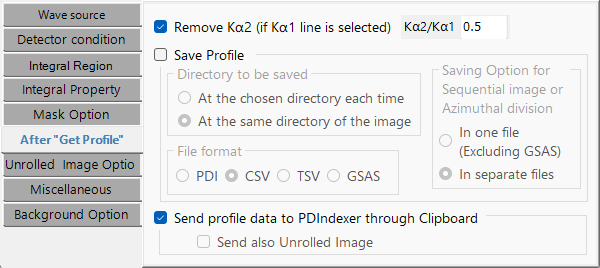
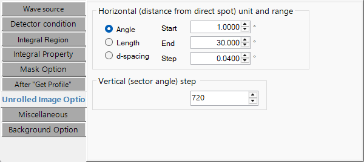
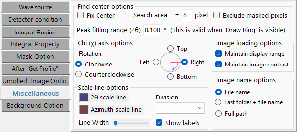
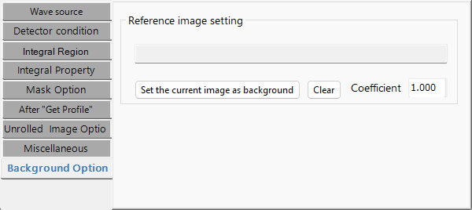

<!-- 260601Cl: Reflected from ja/2-property-windows.md (lead language: Japanese). 260601Cl: per-tab auto-capture images embedded. -->

# Property Windows

Окно свойств — это место, где настраиваются источник, условия детектора и различные условия одномеризации. Каждую вкладку также можно открыть напрямую из меню **Property** в главном окне.

Интерфейс этого окна на английском языке. В заголовках ниже используются фактические имена вкладок и элементов управления.

## Wave source

Задаёт тип падающего пучка и длину волны. Источником может быть рентгеновское, электронное или нейтронное излучение. Для рентгеновских лучей выбор элемента и перехода (линия K, линия L и т. д.) автоматически подставляет длину волны; для синхротронного излучения длину волны вводят напрямую. Для электронного и нейтронного пучков вводят энергию или длину волны (длина волны электрона корректируется релятивистски).

- **Correct linear polarization**: корректирует линейно поляризованную интенсивность к неполяризованному эквиваленту (для синхротронных данных). Формула коррекции ниже зависит от азимута χ (определяемого на вкладке Miscellaneous) и угла рассеяния 2θ.

$$
I_\text{corr}(2\theta,\chi) = \frac{I(2\theta,\chi)}{\sin^2\chi + \cos^2\chi\,\cos^2 2\theta} \times \frac{1}{2}\left(1 + \cos^2 2\theta\right)
$$

## Detector condition

Задаёт геометрические условия детектора. Соответствует устаревшему "IP Condition" с добавлением селекторов системы координат и формы детектора.

- **Coordinates**: **Direct spot** (отсчёт от прямого пятна) / **Foot** (отсчёт от основания перпендикуляра).
- **Detector type**: **Flat panel** / **Gandolfi**.
- **Direct spot position** и **Camera Length 1**: положение прямого пятна (X, Y pix) и расстояние от образца до прямого пятна (mm).
- **Foot position** и **Camera Length 2**: в режиме Foot — положение основания перпендикуляра и расстояние от образца до этого основания.
- **Pixel Shape**: размер пикселя X, Y (mm) и ξ (Ksi, угол скоса параллелограмма).
- **Gandolfi Radius**: радиус, когда выбрана форма Gandolfi.
- **Spherical correction**: сферическая коррекция (обычно ноль).
- **Tilt**: наклон IP φ (Phi) и τ (Tau).

Определения наклона φ, τ и пикселя ξ см. в [Overview](0-overview.md).

## Integral Region

Указывает область изображения, подлежащую одномеризации.

- **Rectangle**: выберите **Direction** (Full / Top / Bottom / Left / Right / Vertical / Horizontal / Free) и задайте **Band Width**, **Angle** (в режиме Free) и **Both Side**.
- **Sector**: укажите угловой диапазон через **Start Angle** / **End Angle**.
- **Exceptional pixels**: исключение **Masked Spots**, пикселей **Under intensity of** / **Over intensity of** заданных порогов и некоторого числа **pixels from edges**.

## Integral Property

Задаёт метод интегрирования и шаг.

- **Concentric integration (scattering-angle dispersive)**: выберите единицу горизонтальной оси из **Angle** (2θ, °) / **Length** (mm) / **d-spacing** (Å) и задайте **Start / End / Step**. **Output pattern** может быть **Bragg - Brentano** или **Debye - Scherrer**.
- **Radial integration (cake pattern)**: анализирует кольцеобразную область в азимутальном направлении. Выберите горизонтальную ось из **Angle** / **d-spacing** и задайте **Donut radius** (центральный радиус), **Donut width** (ширина кольца) и **Sector angle step** (шаг развёртки).

## Mask Option

Задаёт условия маскирования и обнаружения центра/рефлексов (расширение устаревшего "Find Center & Spots").

- **Half mask**: кнопки, которые быстро маскируют верхнюю, нижнюю, левую или правую половину изображения.
- **Manual mask mode**: включает интерактивное маскирование на главном изображении. Формы: **Circle** (перетаскиванием задаются центр и радиус), **Polygon** (щелчками добавляются вершины), **Rectangle** (перетаскивание диагональных вершин), **Spline curve** и **Spot** (щелчок левой/правой кнопкой добавляет/удаляет рефлексы).
- **Takeover**: как обрабатывается маска при загрузке нового изображения (**None** / **Take over the current mask state** / **Take over the mask file**).
- **Find Spots** → **Deviation**: статистический порог для обнаружения рефлексов.
- **Find Center**: диапазон поиска для обнаружения центра и т. п.

## After "Get Profile"

Задаёт сохранение и отправку после одномеризации.

- **Save File**: выберите место назначения ("тот же каталог, что и изображение" или "каталог, выбираемый каждый раз") и формат из **PDI** / **CSV** / **TSV** / **GSAS**.
- **Send PDIndexer**: отправляет профиль через буфер обмена в запущенный экземпляр PDIndexer.

## Unrolled Image Option

Задаёт параметры развёрнутого (Unroll) изображения.

- **Horizontal**: единица (Angle / Length / d-spacing) и **Start / End / Step**. Ширина выходного изображения ≈ (End − Start) / Step.
- **Vertical**: азимутальный шаг (°/pixel). Высота выходного изображения ≈ 360 / step.

Развёртка отображает полярное дифракционное изображение с центром в прямом пятне в декартово изображение (угол vs. расстояние).

## Miscellaneous

Вкладка, собирающая более тонкие настройки отображения и координат.

- **Image name display**: только имя файла / родительская папка + имя файла / полный путь.
- **Contrast / intensity-range persistence**: переносятся ли настройки отображения при загрузке нового изображения.
- **Azimuth χ (Chi) orientation**: опорное положение (Top / Bottom / Left / Right) и направление вращения (Clockwise / Counterclockwise). На χ ссылаются коррекция поляризации и радиальное интегрирование.
- **Scale line**: цвет, толщина, число делений и отображение подписей.
- **Find Center**: диапазон поиска, диапазон подгонки пика, фиксация центра и исключение маскированных пикселей.

## Background Option

Задаёт коррекцию по фоновому изображению.

- **Background image**: задать текущее отображаемое изображение как фон (**Set the current image as background**) или очистить его (**Clear**).
- **Coefficient**: коэффициент, применяемый к фоновому изображению.
- **Edge mask**: дополнительный отступ маски (px), применяемый по краям во время коррекции.

Используется для коррекции плоского поля, удаления рассеяния на воздухе и т. п.

