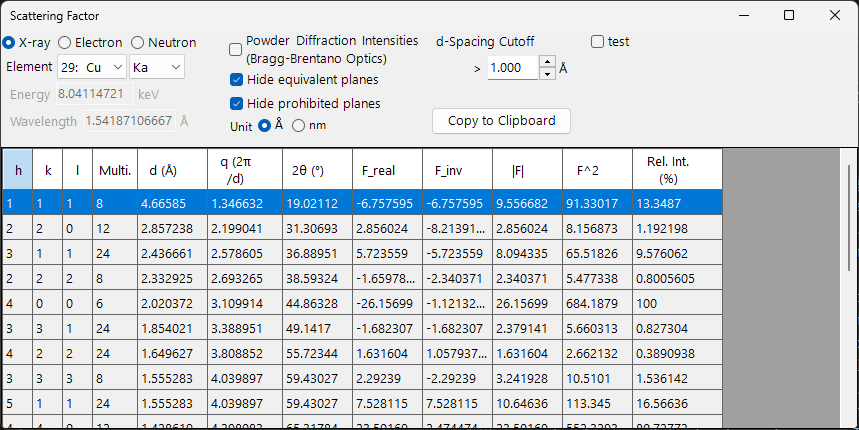
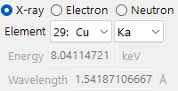

<!-- 260605Cl: Ported from ReciPro docs/src/en/3-scattering-factor.md into the IPAnalyzer appendix (reflected from ja/appendix/a5). The Scattering Factor window is a shared Crystallography.Controls component, identical to ReciPro. -->

# Appendix A5. Scattering Factor

**Scattering Factor** 列出所选晶体的允许晶面（反射），并计算每个晶面的**结构因子**及衍射强度。可以切换辐射类型（X 射线、电子或中子），因此可以在不同衍射技术之间比较同一晶体的结构因子。

在 IPAnalyzer 中，该子窗口从 **Crystal window** 打开（即 [4. 操作步骤](../4-procedures.md) 中用于几何校准、以及 [6. 查找参数（暴力搜索）](../6-find-parameter.md) 中所用的 CrystalControl）。

计算条件位于窗口顶部，反射列表位于底部。每当某个条件改变时，列表都会立即重新计算。

---

## Keyboard & mouse shortcuts

本窗口没有特殊的键盘或鼠标组合。<kbd>F1</kbd> 打开本手册页面，**Copy to clipboard** 则将整个反射表导出为可粘贴到电子表格的文本。

---

## Wave Length Control

- **X-ray / Electron / Neutron** ：原子散射因子因入射束类型而异，因此在此处切换。
- 对于 **X-ray**，选择 **Element**（阳极材料）和特征谱线（Kα 等）会自动设置该特征 X 射线的波长。

- **Energy (keV)** 和 **Wavelength (Å)** 相互关联。
- 该能量或波长用于计算 2θ（衍射角）。对于 X 射线，也可以通过选择元素和谱线类型来设置。

---

## Display & calculation options

- **Powder Diffraction Intensities (Bragg-Brentano Optics)** ：将相对强度计算为粉末衍射（Bragg–Brentano）强度，包含多重性和 Lorentz–polarization 因子。关闭时，则显示结构因子强度。
- **Hide equivalent planes** ：将晶体学上等价的晶面合并为单一条目。
- **Hide prohibited planes** ：排除因消光规则而强度为零的晶面。
- **Unit (Å / nm)** ：切换 d-spacing 等的长度单位。
- **d-Spacing Cutoff** ：排除 d-spacing 小于此值的反射。

---

## Reflection list

每一行对应一个反射（或一组对称等价的晶面）。

| Column | Meaning |
|------|------|
| **h, k, l** | 米勒指数 |
| **Multi.** | 多重性（对称等价晶面的数量） |
| **d (Å)** | 晶面间距 |
| **q (2π/d)** | 散射矢量的大小 |
| **2θ (°)** | 所选波长下的衍射角 |
| **F_real** | 结构因子的实部 |
| **F_inv** | 结构因子的虚部 |
| **\|F\|** | 结构因子振幅 ($= \sqrt{F_\text{real}^2 + F_\text{inv}^2}$) |
| **F^2** | 结构因子强度 ($\lvert F\rvert^2$) |
| **Rel. Int. (%)** | 相对强度，以最强反射设为 100 |

---

## Copy to Clipboard

**Copy to Clipboard** 将列表以文本形式复制到剪贴板，可粘贴到诸如 Excel 之类的电子表格中。

---

## See also

- [附录首页](index.md)
- [4. 操作步骤](../4-procedures.md) —— 定义用于计算结构因子的标准晶体。
- [6. 查找参数（暴力搜索）](../6-find-parameter.md)
