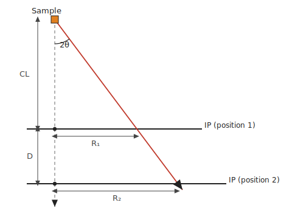
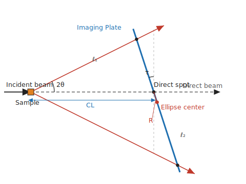

<!-- 260602Cl: Reflected from ja/appendix/a2-calibration.md (lead language: Japanese). -->

# Appendix A2. Parameter determination

由於每個像素的位置都由 [A1. Detector geometry](a1-geometry.md) 的幾何所決定，使用錯誤的參數就意味著在錯誤的位置讀取強度。本頁說明如何從**標準物質**的繞射環，決定真實的參數——相機長度、波長、像素尺寸與 IP 傾斜。實際操作請參閱 [4. Practical procedures](../4-procedures.md) 與 [6. Parameter calibration (brute force)](../6-find-parameter.md)。

---

## Standard material

進行校正時，您要量測一個晶格常數為已知的標準物質。理想的條件是具有**眾多繞射環**、**高 SN 比**、分布**稀疏**，且**無擇優取向**。若無特別偏好，建議使用含有重原子的立方晶，例如 $\mathrm{CeO_2}$ 或 $\mathrm{Ag}$。晶格常數必須已知到約 5 位有效數字。

---

## Camera length — two-distance method

相機長度 $\mathrm{CL}$ 定義為連接試樣與 IP 上直射斑點的距離。若在改變相機長度 $\Delta$ 的同時拍攝兩張繞射圖樣，便可從同一個環的半徑（以像素為單位）$r_1,\ r_2$ 的變化量，決定 $\mathrm{CL}$ 的絕對值。距離差 $\Delta$ 可以用 Magnescale 之類的裝置精確地控制。

{width=440px}

由相似三角形 $\dfrac{r_1}{\mathrm{CL}} = \dfrac{r_2}{\mathrm{CL}+\Delta} = \tan 2\theta$，

$$
\mathrm{CL} = \frac{r_1\,\Delta}{r_2 - r_1}
$$

即可求得。此處 $r_1,\ r_2$ 可維持像素單位，並且即使傾斜校正與像素尺寸校正稍有不準確，乃至標準物質的晶格常數不準確，仍能求得相機長度。由於相機長度因此與其他參數的相關性甚低，它是**應最先決定的參數**。

---

## Wavelength and pixel size — two-line method

若能記錄到兩條繞射線，則無須知道像素尺寸或相機長度，即可從其峰值位置（以像素為單位）的比值 $p_1,\ p_2$ 與其 d-spacing $d_1,\ d_2$，計算出繞射角 $\theta_1,\ \theta_2$。設 d-spacing 比為 $\rho_d = d_1/d_2$，峰值位置比為 $\rho_p = p_1/p_2$。

由 Bragg 定律與平板偵測器的幾何，

$$
2 d_i \sin\theta_i = \lambda \quad(i=1,2), \qquad p_i \cdot \mathrm{PixSize} = \mathrm{CL}\,\tan 2\theta_i
$$

成立。由第一式的比值得 $\sin\theta_2 = \rho_d \sin\theta_1$，由第二式的比值得 $\rho_p = \tan 2\theta_1 / \tan 2\theta_2$。代入 $\tan 2\theta = \dfrac{2\sin\theta\sqrt{1-\sin^2\theta}}{1-2\sin^2\theta}$，得到唯一未知數為 $\sin\theta_1$ 的方程式：

$$
\rho_p = \frac{\sqrt{1-\sin^2\theta_1}\,\big(1 - 2\rho_d^2\sin^2\theta_1\big)}{\rho_d\,\sqrt{1-\rho_d^2\sin^2\theta_1}\,\big(1 - 2\sin^2\theta_1\big)}
$$

這可化為關於 $\sin^2\theta_1$ 的三次方程式。由於解析求解需要處理虛數，本軟體以**數值方式**求解以取得其值。由於 $\rho_d$ 是 d-spacing 的比值，依晶體對稱性（例如立方晶系）可以無誤差地決定。

一旦求得繞射角，相機長度便可由上述兩距離法獨立決定，因此波長 $\lambda$ 與像素尺寸 $\mathrm{PixSize}$ 也能輕易地由上述兩式計算出來。

!!! note "When there is a tilt"
    若 IP 有傾斜，則關係式 $p_i \cdot \mathrm{PixSize} = \mathrm{CL}\tan 2\theta_i$ 不再成立，因此無法直接求得準確的值。此情況下，請**交替進行傾斜校正與波長校正**，使解疊代地收斂至真實值。

---

## IP tilt — ellipse fitting

錐角為 $2\theta$ 的環，在未傾斜的 $XY$ 平面上應觀察為半徑 $R_0 = \mathrm{CL}\tan 2\theta$ 的正圓。然而在傾斜的 IP 上，該環會變成**橢圓**，而且其中心並不與束流中心（直射斑點）重合。

{width=460px}

在以 $\varphi,\ \tau$ 傾斜的 IP 平面上，環上的一點 $(x,y)$ 滿足一般的圓錐曲線（橢圓）

$$
A x^2 + 2 B xy + C y^2 + D x + E y = 1
$$

係數 $A,B,C,D,E$ 可寫成 $\varphi,\ \tau,\ \mathrm{CL},\ R_0$ 的函式，並可用如下的初等線性代數處理。

- **橢圓的中心** $(x_c, y_c)$ 是梯度為零此條件的解，亦即聯立線性方程式
  $$
  \begin{pmatrix} A & B \\ B & C \end{pmatrix}\begin{pmatrix} x_c \\ y_c \end{pmatrix} = -\frac{1}{2}\begin{pmatrix} D \\ E \end{pmatrix}
  $$
- **長軸與短軸的方向及長度**，可藉由求解對稱矩陣 $\begin{pmatrix} A & B \\ B & C \end{pmatrix}$ 的特徵值問題而獲得。

由這些結果，傾斜可如下決定。

1. **方位角 $\varphi$**：橢圓中心的位移沿著最陡傾斜方向（最大梯度方向）發生，而傾斜軸與其正交。因此傾斜軸的方向由 $(-y_c,\ x_c)$ 給出，並由此決定 $\varphi$。
2. **傾斜量 $\tau$**：考慮沿 $\varphi$ 方向投影的圖形（上圖），由直射斑點到橢圓中心的距離 $R$ 滿足一個相機長度、傾斜量與繞射角的函式：

    $$
    R = \frac{\mathrm{CL}\,\sin 2\theta}{2}\left( \frac{1}{\cos(2\theta+\tau)} - \frac{1}{\cos(2\theta-\tau)} \right)
    $$

    對 $\tau$ 求解此方程式。當有多個繞射環可用時，取從各環求得的 $\tau$ 的**加權平均**作為真實值。
